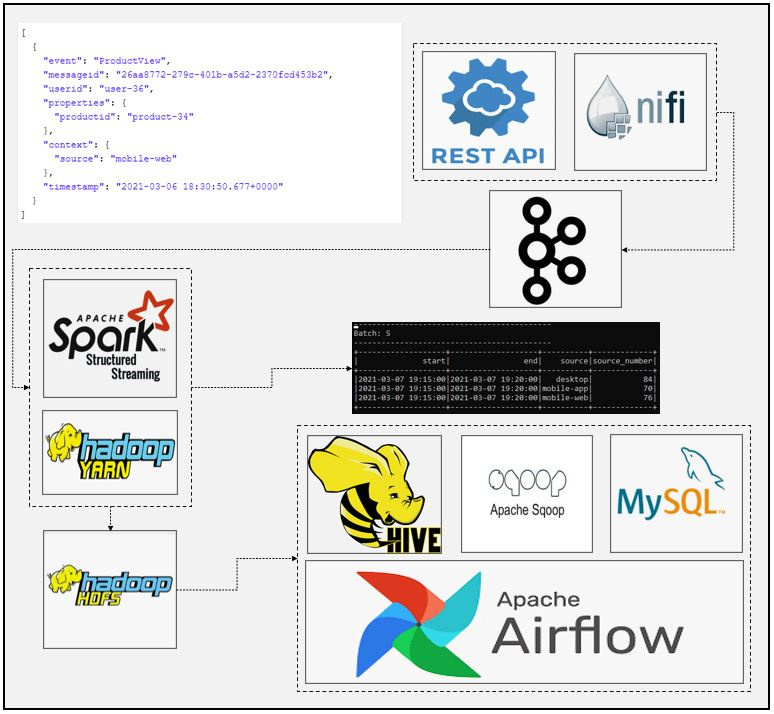
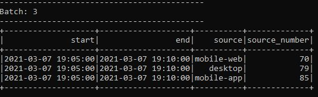

# SparkStream E-commerce Connected Platforms in Last 5 minutes
### Dataflow Pipeline


### Summary

In this application we used 100.000 click data and simulate those data as 1 click each second using apache kafka and apache nifi. Apache nifi used to transform raw data and make it ready for analysis. SparkStream api used to perform necessary transformations. Results aggregated each 5 minutes and printed to consele for visualization. Spark's 5 minutes window function used to aggregate data in 5 minutes interval. Same data consumed stored into HDFS and Apache Hive table. Apache Airflow used to schedule data export from Apache Hive to Mysql using Apache Sqoop.

### Task List

- [x] Check json data from data folder


- [x] Create nifi pipeline


- [x] Create kafka topic
- [x] Create spark session and define schema
```
if __name__ == "__main__":
    spark = SparkSession \
        .builder \
        .appName("Tumbling Window Stream Users Platform") \
        .master("local[3]") \
        .config("spark.streaming.stopGracefullyOnShutdown", "true") \
        .config("spark.sql.warehouse.dir", warehouse_location) \
        .config("spark.sql.shuffle.partitions", 2) \
        .enableHiveSupport() \
        .getOrCreate()

#Describe schema (productid will be enough to find viewed category in the last 5 minute)
    schema = StructType([
    StructField("context", StructType([
        StructField("source", StringType())
    ])),
    StructField("timestamp", StringType())
])
```
- [x] Read data from kafka topic
```
#Read data from kafka topic
    kafka_df = spark.readStream \
        .format("kafka") \
        .option("kafka.bootstrap.servers", "localhost:9092") \
        .option("subscribe", "platform") \
        .option("startingOffsets", "earliest") \
        .option("failOnDataLoss", "false") \
        .load()
```
- [x] Deserialization and transformations of data
```
#Data in kafka topic have key-value format, from_json is used to deserialize json value from string
    value_df = kafka_df.select(from_json(col("value").cast("string"), schema).alias("value"))
#Checking schema if everything is correct
    value_df.printSchema()
#Explode dataframe to remove sub-structures
    explode_df = value_df.selectExpr("value.context.source", "value.timestamp")
#Checking schema if everything is correct
    explode_df.printSchema()
#Set timeParserPolicy=Legacy to parse timestamp in given format
    spark.sql("set spark.sql.legacy.timeParserPolicy=LEGACY")
#Convert string type to timestamp
    transformed_df = explode_df.select("source", "timestamp") \
        .withColumn("timestamp", to_timestamp(col("timestamp"), "yyyy-MM-dd HH:mm:ss")) \

#Checcking schema if everything is correct
    transformed_df.printSchema()
```
- [x] Create 5 minutes window
```
#Create 5 min window
#Create watermark to autoclean history
#Groupby product_id and count considering distinct users
#Rename new column as count
    window_count_df = transformed_df \
        .withWatermark("timestamp", "5 minute") \
        .groupBy(col("source"),
            window(col("timestamp"),"5 minute")).count()

    output_df = window_count_df.select("window.start", "window.end", "source", "count") \
        .withColumn("source_number", col("count")) \
        .drop("count")
```

- [x] Createforeach batch function to perform aggregations and write data to console
```
#Define foreach batch function to aggrate stream data several times and print console
def foreach_batch_func(df, epoch_id):
    df = df.sort(desc("source_number"))
    df \
        .write.format("console") \
        .save()
    pass
```
- [x] Write data into console and hdfs
```
#Write spark stream to console or csv sink
    window_query = output_df.writeStream \
    .foreachBatch(lambda df, epoch_id: foreach_batch_func(df, epoch_id))\
    .outputMode("update") \
    .trigger(processingTime="5 minutes") \
    .start()

# Write raw data into HDFS
    output2_df.writeStream \
      .trigger(processingTime='5 minute') \
      .format("parquet") \
      .option("path", "hdfs://localhost:9000/tmp/data/ecommerce") \
      .option("checkpointLocation", "chk-point-dir") \
      .start()
```
- [x] Check the results to find connected platforms in last 5 minutes




- [x] Create mysql table

- [x] Create airflow dag file (dag_file.py)

- [x] Define default default_args
```
default_args = {
    "owner": "airflow",
    "email_on_failure": False,
    "email_on_retry": False,
    "email": "admin@localhost.com",
    "retry": 1,
    "retry_delay": timedelta(minutes=5)
}
```
- [x] Define function to download json data into application data directory
```
#Function to download file and create json file
def download_rates():
    BASE_URL = "https://raw.githubusercontent.com/euguroglu/Spark_Nifi_Kafka_Connected_Device_Stream/master/data/product-views.json"

    indata = requests.get(f"{BASE_URL}")

    open('/home/enes/Applications/BD_Project_1/data/product-views.json', 'wb').write(indata.content)

```
- [x] Initialize dag
```
with DAG("ecommerce_platform",start_date=datetime(2021, 1, 1),
         schedule_interval="@daily", default_args=default_args, catchup=False) as dag:
```

- [x] Define http sensor task
```
#HTTP sensor example
is_connection_available = HttpSensor(
   task_id = "is_connection_available",
   http_conn_id = "data_api",
   endpoint = "euguroglu/Spark_Nifi_Kafka_Connected_Device_Stream/master/data/product-views.json",
   response_check = lambda response: "event" in response.text,
   poke_interval = 5,
   timeout = 20
)
```
- [x] Define python operator task to download data
```
#Python operator example
downloading_rates = PythonOperator(
   task_id = "downloading_rates",
   python_callable = download_rates
)
```
- [x] CDefine spark operator task to initialize spark job
```
#Spark operator
commerce_processing = SparkSubmitOperator(
   task_id = "commerce_processing",
   application = "/home/enes/Applications/BD_Project_1/nifi_spark_kafka_product_view_platform_v2.py",
   conn_id = "spark_conn",
   verbose = False,
   packages = "org.apache.spark:spark-sql-kafka-0-10_2.12:3.0.1"
)
```
- [x] Define python operator to delay between tasks
```
#Python operator example delay
delay_python_task = PythonOperator(
   task_id = "delay_python_task",
   python_callable = lambda: time.sleep(60)
)
```
- [x] Define hive operator task to create hive table from parquet file
```
#Hive operator
creating_commerce_table = HiveOperator(
   task_id="creating_commerce_table",
   hive_cli_conn_id="hive_conn",
   hql="""
       CREATE EXTERNAL TABLE IF NOT EXISTS commerce(
           source STRING,
           source_number BIGINT
           )
       ROW FORMAT DELIMITED
       FIELDS TERMINATED BY ','
       STORED AS PARQUET
       LOCATION '/tmp/data/ecommerce';
   """
)
```
- [x] Define sqoop operator task to transfer data from hive to mysql
```
#Sqoop Operator
hive_to_mysql = SqoopOperator(
   task_id = "hive_to_mysql",
   conn_id = "sqoop_conn",
   cmd_type = "export",
   table = "commerce",
   hcatalog_table = "commerce"
)
```
- [x] Create e-mail operator to send notification when task is done
```
#Email operator
send_email_notification = EmailOperator(
   task_id = "send_email_notification",
   to = "airflow_course@yopmail.com",
   subject = "commerce_data_pipeline",
   html_content = "<h3>commerce_data_pipeline</h3>"
)
```
- [x] Check results


### Code Description

Active_Users_Pipeline.xml is nifi pipeline to simulate dataflow and perform ETL operations as well as sending data to kafka topic.

nifi_spark_kafka_product_view_platform_v2.py is spark streaming code for data processing, analysis and sink operations.

dag_file.py file is airflow data pipeline to schedule data transfer between hive to mysql as well as initialize spark job.


### Running

1. Start zookeeper (Check kafka scripts)

```
zookeeper-server-start.bat config\zookeeper.properties (zookeeper-server-start.sh for linux)
```

2. Start kafka (Check kafka scripts)
```
kafka-server-start.bat config\server.properties  (kafka-server-start.sh for linux)
```

3. Start nifi and processors

4. Open Airflow UI and initialize dag

5. Start mysql server and hive server

6. Check results and email inbox
